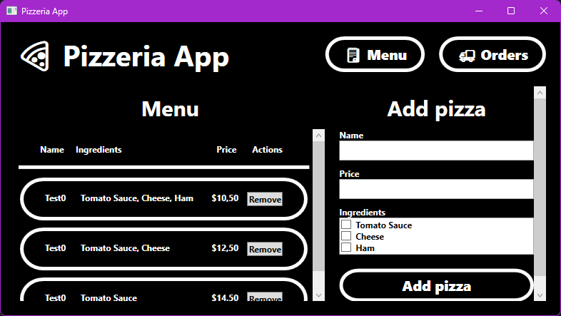
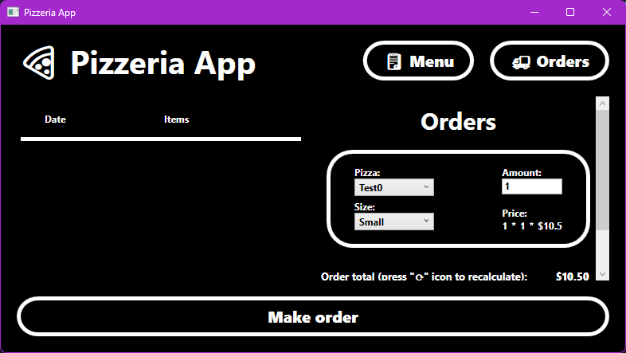

# Pizzeria App

App made for **Object Oriented Programing** lessons at WSEI.

**Name**: Marcin Włodyka

**Index**: 13860

## Menu view

View for displaying and altering your pizzas list. On the left side you can see your pizzas, and remove them. Right side allows you to add a new pizza by typing its name, price and selecting ingredients.

## Orders view

View for displaying and adding your orders. Left side display your orders, and right side allows you to add a new order.