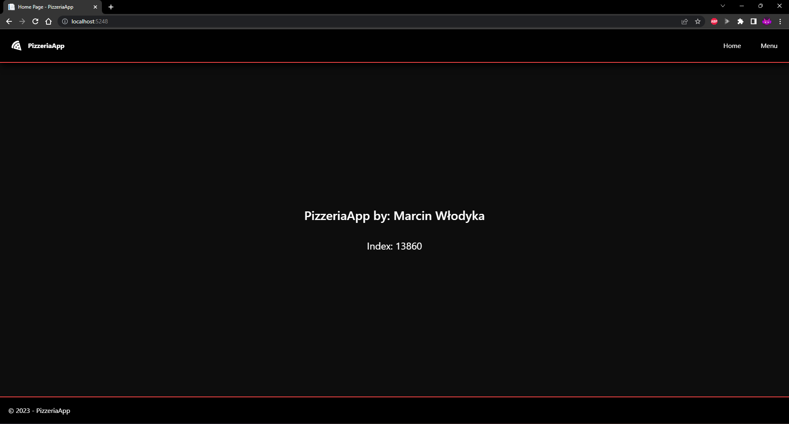
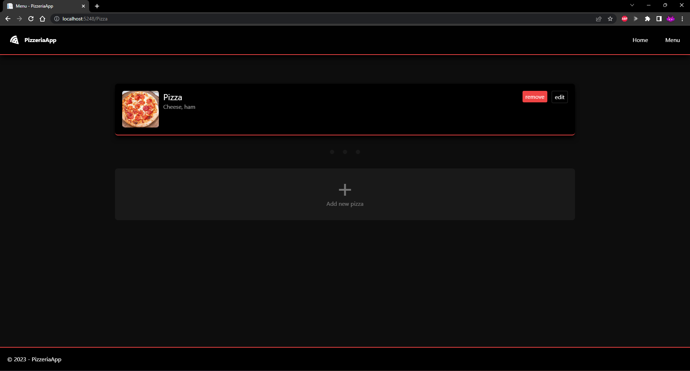
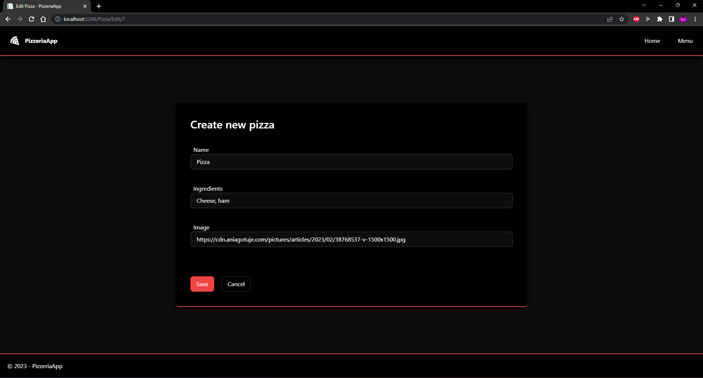
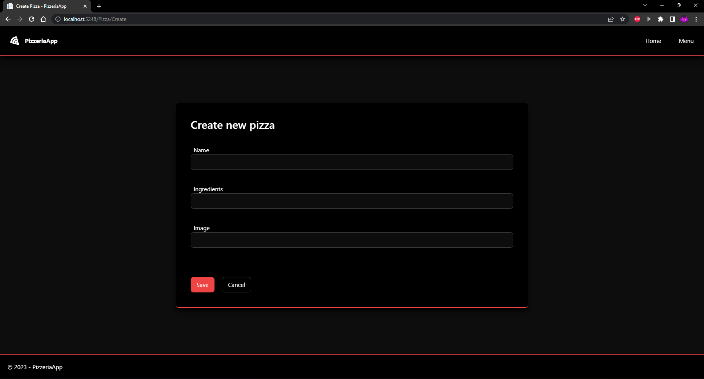

## **PizzeriaApp**
## **Author:** Marcin Włodyka
### **Index:** 13860

---

## Requirements
dotnet: `7.0`

## Installation

```bash
git clone https://github.com/marcinwlodyka/PizzeriaApp.git
dotnet run # to start server
```

## Usage

### From the home on the left side of a header you can go to `Menu`


### In `Menu` you can see all added pizzas, add them, remove them and edit them



### Clicking `Edit` will take you to edit form page


### Clicking `Add new pizza` will take you to creation form

